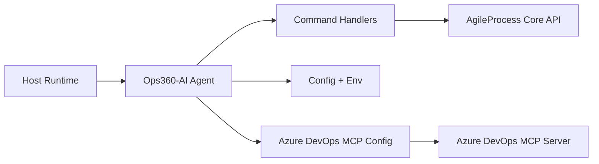

# Architecture

## Overview
Ops360-AI is a lightweight planner agent with three command handlers. Each handler normalizes the input and calls AgileProcess Core APIs to generate planning output.

## Components
- `src/agent.ts`: Entry point that exposes command handlers.
- `src/handlers/*`: Input normalization and command routing.
- `src/clients/agileCoreClient.ts`: HTTP client for AgileProcess Core.
- `src/clients/azureDevOpsMcpClient.ts`: MCP wrapper stub for Azure DevOps.
- `config/default-config.json`: Default settings and endpoint paths.
- `mcp/azure-devops.json`: MCP connection settings.

## Data Flow
1. Host loads the agent and calls `activateAgent()`.
2. A command name and input payload are passed to the matching handler.
3. The handler loads file-based inputs (if provided) and calls AgileProcess Core.
4. The API response is returned to the host.

## Configuration Strategy
- Base configuration is loaded from `config/default-config.json`.
- Environment variables override the config file.
- MCP configuration follows the same pattern, using `mcp/azure-devops.json`.
